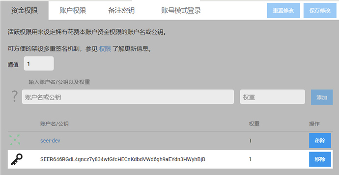
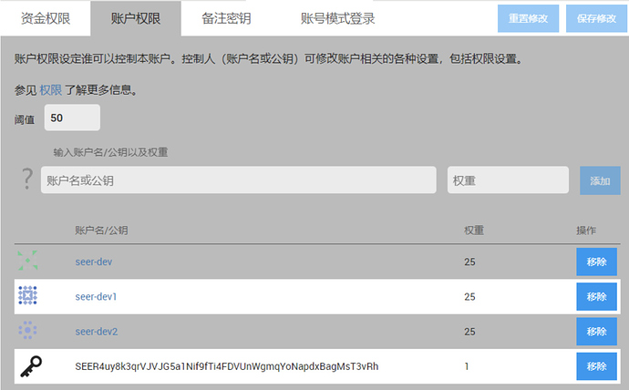

# 赛亚技术文档

通过本指南，让您快速体验搭建SEER见证人节点、使用命令行钱包、使用SEER链上功能，甚至基于SEER开发DAPP等。

<a router-link="./cli">`命令行钱包`</a> 相关文档请点击这里；

<a router-link="./witness">`见证人`</a> 相关文档请点击这里；

<a router-link="./tools">`开发工具`</a> 相关文档请点击这里；

  此文档站各种资料适合有一定技术基础的用户，若要进行开发体验，请使用 <a href="http://123.206.78.97/"> **测试网络** </a> 进行体验，以免误操作造成资金损失。

**测试网络账号**：okok **私钥**：5JkbV8aTaYRVaarTUJQ9Y56cr4QajxNFfCoQj6Q9JFL8XvUZ5CQ 内有上千万测试币，欢迎体验。

## SEER基本介绍

### SEER的账户体系

SEER的账号名有**普通账号名**和**高级账号名**之分，账号名带`元音aeiouy`但又不带数字和`点(.)`和`横(-)`的账号名属于`高级账号名`，注册费会高于普通账号名。

SEER的账号又分`普通会员`和`终身会员`：

新注册的用户均为`普通会员`，可消费SEER升级为`终身会员`;

#### 终身会员特权

1. 使用SEER功能的手续费打折（6折）

2. 有权创建见证人、理事会成员、其他系统角色

3. 邀请并注册新账号的推广激励

#### SEER的账户权限体系组成

1. 资金**权限**

2. 账户**权限**

3. 备注密钥

#### **权限**的组成

1. 阈值

2. **授权**列表含各自权重

#### **授权**的种类

1. 账户id

2. 公钥

3. 地址

当授权的权重达到阈值时，则可执行该权限。

##### 示例一

此例中，资金权限的阈值为`1`

账号`seer-dev`和公钥`SEER646RGdL4gncz7y834wfGfcHECnKdbdVWd6gh9aEYdn3HWyhBjB`的权重均达到了阈值

则：`seer-dev`和`SEER646RGdL4gncz7y834wfGfcHECnKdbdVWd6gh9aEYdn3HWyhBjB`两者均可以动用该账号的资金。

##### 示例二

账户权限的阀值为`50`

账号`seer-dev`和`seer-dev1`、`seer-dev2`权重各为`25`

则：要想成功修改该账号，至少需要`seer-dev`、`seer-dev1`、`seer-dev2`三人中的其中`2`个人的授权（签名），使权重为`25+25=50`，达到阀值要
求的`50`。

修改账户时注意：最好将备注密钥设成成资金密钥相同。

### SEER见证人

SEER的见证人分成两部分：主力见证人和获息见证人。详细设计思想及操作方式见：<a router-link="./witness">`见证人`</a> 相关文档。

#### 1. 主力见证人

具备打包出块权限的见证人。该见证人必须配置并运行节点程序以打包出块。

#### 入选条件

抵押排名前21名，并且前2天没有丢块超过50%的。

##### 入选收益

打包出块收入，每出一个块，奖励3SEER，实时发放至`“待领取余额”`中。

#### 2. 获息见证人

具备获取利息的见证人。获息见证人包含主力见证人和候选见证人。

##### 入选条件

抵押总量排名前101名即可。

##### 入选收益

抵押的利息收入。

##### 收益发放

新加坡时间每天8：00

##### 见证人竞选更新时间

新加坡时间每天8：00

#### 利息计算公式

##### 当天总利息支出

每天可支出的总抵押分红=（`资金池余额` – `622080000`）/ `5400`

##### 当天见证人的利息收入

用户每天可获得的抵押收益 = 当天总利息支出 x 个人抵押金 / 获息见证人总抵押金

##### 初始资金池

初始资金池余额为20亿，在SEER的token分配方案中，将有`20亿`SEER用作DAPP和见证人激励。

##### 资金池的消耗

见证人的出块支出和利息支出均从资金池中扣除

##### 资金池的收入

用户在SEER上支付的手续费，60% 注入资金池

##### 利率说明

排名对利息的利率有细微影响

第一名比第N名高0.02%(N-1)

第1名的利率比第101名高0.02%(101-1) = 2%

假设第一名的日利率是0.1%，那么

第2名是0.09998%

第3名是0.09996%

第4名是0.09994%

…

第101名是0.098%

### 用户发行资产

Seer允许用户创建各种自定义资产(UIA)。自定义资产的应用场景数不胜数。比如，UIA可被用来代替简单的活动门票，存入合格用户的手机钱包中，在进入活动现场时进行实时验证。同样，UIA可被用来进行众筹、所有权追踪，甚至是代表公司的股权。

#### 资产属性列表

1. 名字

2. 精度（几位小数）

3. 发行人（创建者）

4. 最大供应量（总量上限）

5. 市场交易手续费率（百分比比如0.1%）

6. 市场交易手续费上限

7. 资产开通的权限

8. 资产已激活的权限

9. 跟SEER主资产的手续费汇率（手续费池汇率）

10. 持有人白名单

11. 持有人黑名单

12. 市场交易授权名单（只可以跟什么资产交易）

13. 市场交易黑名单（禁止跟什么资产交易）

14. 动态参数对象（包括：当前供应量；隐私交易量；收集到的手续费；手续费池余额）

#### 合规化功能

不同使用场景的法律法规可能天差地别，所以Seer提供了资产管理功能来帮助创建者来合规发行和管理资产，功能清单如下：

1. 收取交易手续费

2. 要求资产持有人预先加入白名单

3. 发行人可将资产收回

4. 所有转账必须通过发行人审核同意

5. 禁止隐私交易

需要注意的事，以上权限也是可以关闭的。一旦关闭某项权限，便不可重新打开。权限需要激活才会生效。

### SEER相关程序说明

#### 下载网址

##### node/cli

https://github.com/seer-project/seer-core-package/releases

##### Seer-UI安装包

https://github.com/seer-project/seer-UI-package/releases

#### 启动方式

##### witness_node
命令行方式运行
witness_node为重钱包
运行witness_node的计算机可从p2p网络中同步完整的区块链数据，同步完成后该计算机成为一个全数据节点（具有完整的区块数据）。
运行示例:
A,windows
witness_node.exe --p2p-endpoint=0.0.0.0:1888 --rpc-endpoint=0.0.0.0:8002
B,ubuntu
./witness_node --p2p-endpoint=0.0.0.0:1888 --rpc-endpoint=0.0.0.0:8002
其中8002为提供给cli_wallet和GUI钱包连接的端口
2,cli_wallet
witness_node为轻钱包
命令行方式运行
运行cli_wallet连接至witness_node，可进行各种操作（纯粹的功能比GUI前端钱包丰富），包括注册用户、升级会员、创建资产、升级资
产、投票、查询余额、查询账号历史、查询区块、查询区块参数…

运行示例：
A,windows
cli_wallet.exe -s ws://127.0.0.1:8002
B,ubuntu
./cli_wallet -s ws://127.0.0.1:8002
其中127.0.0.1为witness_node程序的IP，这里为本机，8002为witness_node开放的端口
3,Seer-UI
GUI版本轻钱包，可至https://wallet.seer.best 或下载GUI安装包进行体验

五、SEER预测类型介绍
1，LMSR
LMSR类型的预测，用户的参与量可以是负数，负数即卖出。
LMSR参与量的单位为“份”，价格是需要根据份数即时计算的，比如卖出1份价格为1，但卖出2份价格未必是2，前端可对相应数量的买卖
价格做初步计算。
LMSR玩法的优势：参与预测的过程可以伴随自由的买卖，用户可以在预测结果出来之前卖出获利或者止损。预测的参与量的买卖可以使
预测倾向流动加快，即更快的向概率最大的选项倾斜。
2，PVP
用户自由参与预测，该预测类型没有庄家，预测参与资金全部分给预测正确者。

3，Advanced
高级预测类型
A，房主可设置各个选项的赔率
B，房主可随时修改赔率
C，用户预测以参与时间点的赔率计算中奖回报
D，房间有预设资金池的概念
E，在预测进程过程中，房主可往资金池添加资金，不可提取资金
F，预测未开启时，房主可添加或提取资金池资金
G，用户参与时，若当前总资金（含资金池和用户参与资金）可能不够派奖，则参与失败

## SEER网页钱包使用指南

  1. 目前的网页钱包是一个基于石墨烯通用钱包添加了部分SEER特有功能的 `开发者版本` ，仅支持 `电脑版的谷歌浏览器` ，请 `不要` 使用手机或其他浏览器登录；  
  
  2. 目前的操作体验可能不尽如人意，若你不具备基本的计算机操作技能，请严格根据教程指示操作，并做好 `备份` ，随意操作或未进行有效备份将造成不可逆转的资产损失，强烈建议对自己操作没有信心的用户不要转入资产;  
  
  3. 区块链是多中心化的设计，` 您在创建账户时设置的密码只是一个钱包解锁密码，需要通过备份bin文件等形式对钱包进行备份` ，如果因为错误操作遗失了bin备份文件或是账号密码私钥，将永久性失去对资产的使用权限;  
  
  4. 请务必认真阅读此教程，按照教程指示操作，完成备份并牢记密码，`SEER不会保存您的bin备份文件和私钥，也无法提供密码找回功能` ，请一定对自己的资金负责;  
  
  5. 已注册SEER主网账号的用户，请务必检查自己是否已完成了 `bin文件备份，并妥善保管好了bin备份文件` ;  
  
  6. 在转入大额资金前，请务必转入`小额资金进行转入转出测试` 。

### 注册

#### 下载谷歌浏览器

谷歌浏览器下载地址：https://www.google.cn/chrome

因为谷歌被墙，墙内用户可能需要科学上网或百度搜索第三方下载渠道。

#### 进入SEER网页钱包

进入SEER主网网页钱包：https://wallet.seer.best

  有时进入主网钱包时会提醒：`无法与API服务器同步` ，这是由于您的计算机系统时钟和区块链上的时间 `时差过大` ，或因`同一时间访问API的用户太多` 等原因 `连接API服务器失败` 引起的。请 `校准系统时间`、`刷新页面`、`清空浏览器缓存`或`避开高峰期重新尝试`。

#### 创建账户

登陆首页，`点击国旗`切换为中文；

点击`“创建账户”`，会跳转到 `创建账户` 页面

<a href="https://wallet.seer.best"> `SEER主网网页钱包` </a> 提供免费的水龙头账号注册服务，让你无需支付手续费就能注册一个SEER账户。

水龙头代付手续费的规则是由水龙头（账号注册服务提供商）制定的，DAPP、第三方钱包等方面都有动力提供这项服务（因为被注册账户在主网的手续费消耗将让注册人得到手续费分成）。

**目前SEER网页钱包的水龙头注册规则**

1.长度不能小于`6`个字符；

2.不能包含元音字母`aeiouy`；

3.或包含数字和连字符“-”；

4.`每个IP每天只能注册一个账户`，一个局域网内多人注册容易被误识别为同一地址。

填写您想创建的`免费账户名`、`钱包解锁密码`、`确认密码`，点击 `“创建账户”` 完成注册。

说明：这一步中输入的钱包解锁密码是在您的电脑上为设置的为钱包加密解锁的密码，并不是账号真正的“密码”，没有被记录到区块链上，光记得此密码无法在另外的设备上登录您的账号，您真正的密码是私钥的形式存在钱包里，需要在下一步中导出备份bin文件。

如果创建的用户名不合格报错，重新尝试创建用户名时只需要再输入您要创建的用户名，不需要再设置钱包解锁密码，因为您在之前注册时已经同时申请注册了一个钱包和钱包里的一个账号，就算账号注册失败，钱包也已经创建成功。

### 备份

请不要忘记备份 `bin文件` ，需要此文件实现在不同浏览器和设备中恢复你的账户。

#### 备份bin文件

点击 `“为钱包 DEFAULT 创建备份”`，并将备份文件`下载到本地`，存放在`可靠`的地方，千万不能丢失，以后在其他地方登陆会需要这个文件。钱包没有`登录/注销`的概念，只需要将钱包`解锁`即可使用钱包里的各项功能。如果需要`强制清除此设备上的钱包操作权限`，需要清空浏览器缓存。

#### 安全存储bin备份文件

bin备份文件文件名类似：`seer_default_20180705.bin`。bin文件十分重要， **千万不能弄丢** ，并且对钱包及账户的每次修改（包括但不限于私钥权限修改、注册新账号、修改钱包解锁密码等）都需要`重新备份bin文件`，推荐您通过邮箱、U盘、云盘等方式备份。

#### 其他备份方式

`bin钱包`是一种比明文私钥更安全的二次防护备份文件，若您对自己存储、记录私钥的能力和存储设备安全有信心。可以通过`以下方式`导出明文私钥或脑钱包。

##### 导出私钥

1、菜单-权限-`资金权限`：点击资金权限公钥，在弹出页面点击 `显示` ，输入钱包解锁密码，复制下显示的明文私钥；

2、菜单-权限-`账户权限`：点击账户权限公钥，在弹出页面点击 `显示` ，输入钱包解锁密码，复制下显示的明文私钥；

3、`备注密钥`一般与`资金权限`一致，若你进行了修改，需要对历史中你用过的所有备注私钥进行备份，否则无法查看部分交易中的memo备注。

私钥抄写容易出错，明文存储也有资金安全风险，请慎重保存。

##### 导出脑钱包（助记词）

菜单-设置-备份-创建本地钱包备份下拉列表中选择`脑钱包`备份。脑钱包是私钥的另一种表达形式，由16个随机生僻单词组成，建议`抄写到纸上`，脑钱包具有账户的`完整控制权限`，需要妥善保管，泄露容易导致资产被盗。

### 导入

以下步骤让你在其他设备恢复您的SEER钱包和账号。

#### 初次登陆网页钱包时恢复账号

在其他电脑或浏览器设备恢复钱包时，在登陆首页点击“restore your account”，选择备份文件，填入密码即可恢复钱包备份。

#### 新建钱包后导入账号私钥

菜单-设置-本地钱包-新建钱包，填入新钱包的解锁密码和钱包名字，可以新建一个空钱包。

新建钱包以后会跳转到创建账号页面，这是因为钱包是空的，如果你浏览器中原本有钱包和权限，可在菜单-设置-本地钱包-新建钱包上方下拉菜单切换，可以切换回原来的钱包。

**如果需要导入私钥到新钱包则继续：**

菜单-设置-恢复/导入-从`钱包备份文件恢复`下拉菜单中 选择 `导入私钥` ,在输入框中填入要导入的私钥,点击提交。（资金私钥和账户私钥需要分别导入）

如果有多个账号私钥可以继续导入，导入完成后可以点击右上角账号名在不同账号之间切换。

#### 使用脑钱包恢复账号

菜单-设置-恢复/导入-从`钱包备份文件恢复`下拉菜单中 选择 `从脑钱包秘钥恢复钱包` ,因为从脑钱包恢复前，你需要新建一个新的钱包，所以在这一步中要设置新钱包的解锁密码及钱包名，然后点击`创建新钱包`。

#### 在命令行钱包导入私钥

此步骤参考 <a router-link="./cli?id=_5-import_key"> **通过私钥导入账户** </a> 相关文档请点击这里。

### 网关

在SEER主网钱包中提供了BTS、ERC20资产和主网资产互转的双向网关，这是测试网络中不具备的。在bitshares和ethereum网络中分别转账SEER资产到SEER的网关账号，即可实现主网中账号自动确认到账，反之也可将SEER主网资产转为交易所、钱包等处的SEER。

#### 内盘GDEX.SEER至主网

持有内盘资产GDEX.SEER（比特股内盘GDEX.IO、鼓鼓钱包）的用户可以直接使用此网关和主网SEER进行兑换。

特别注意：持有内盘资产SEER的用户需要先通过GDEX.SEER：SEER交易对1:1兑换为GDEX.SEER，再使用网关兑换为主网SEER。

将 `BTS内盘` 的 `GDEX.SEER` 转账至 `seer.gateway`（数字 ID#974186）转账 `memo` 备注填：`“seer#主网帐号”`（双引号不需要填写），即可完成主网 `SEER` 自动发放，第一次建议小额转账先试一下。

#### 主网至内盘GDEX.SEER

在 `SEER主网` ，点击`“网关”`选项卡，选择 `转出BTS代币` ，填写`您的BTS账号`，即可完成BTS内盘资产`GDEX.SEER`的自动兑换，建议先小额转账进行测试。

目前BTS网关的转入或者转出手续费均设定为 2 SEER。

#### Erc-20至主网

持有`Erc-20`版SEER（Bitfinex、Aex、Lbank等交易所内SEER和imtoken等以太坊钱包内SEER）的用户可以直接使用此网关兑换和主网SEER进行兑换。

在SEER主网，点击`“网关”`选项卡，选择`转入（ERC20）`，`“点击生成”`绑定ETH地址按钮。

绑定成功以后，网关页面便会自动生成一个和您的SEER账户绑定的`以太坊地址`，请勿充入非SEER资产。

在交易所或imtoken等处，`提币或转账`到您SEER账号绑定的以太坊地址，即可完成Erc-20版SEER 至 SEER主网的自动兑换，建议先小额转账进行测试。

#### 主网至Erc-20

在SEER主网，点击`“网关”`选项卡，选择`转出（ERC20）`，转账到交易所生成的SEER充值地址或是您的imtoken等以太坊钱包地址，即可完成SEER主网至Erc-20版SEER的自动兑换，建议先小额转账进行测试。

